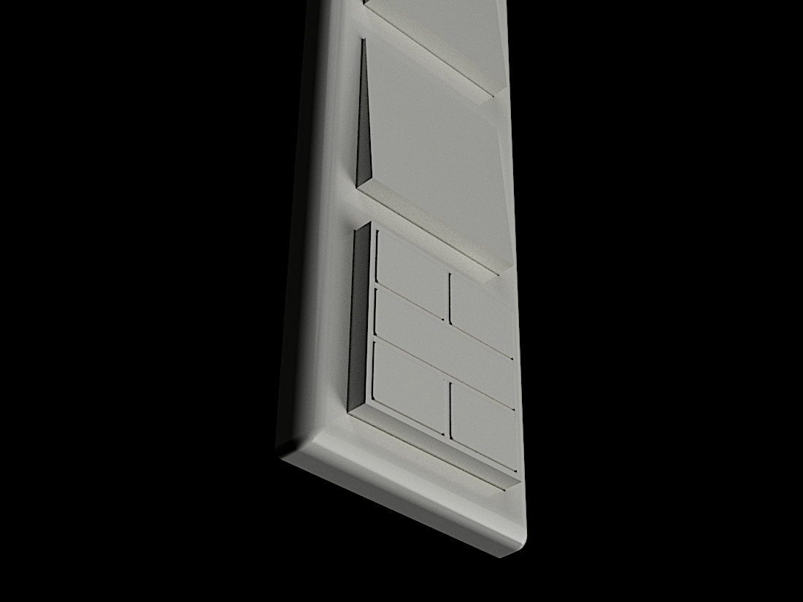
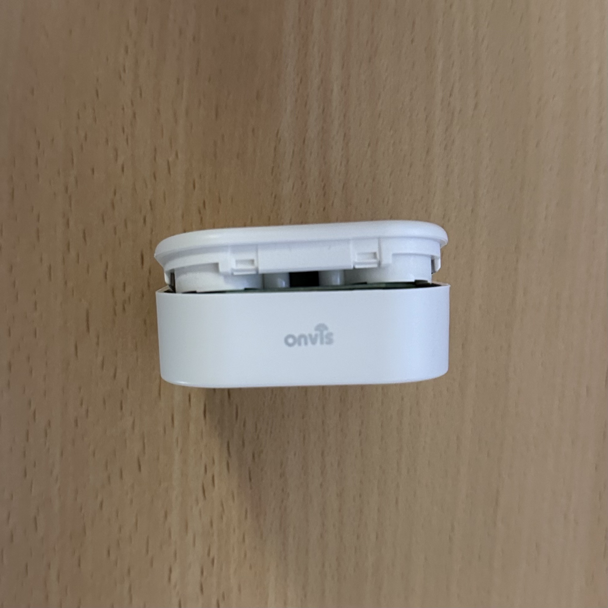
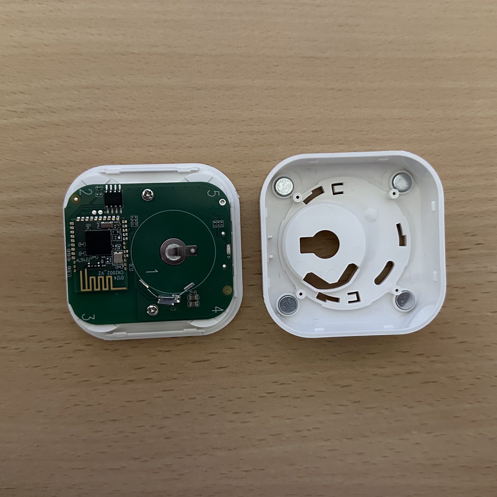
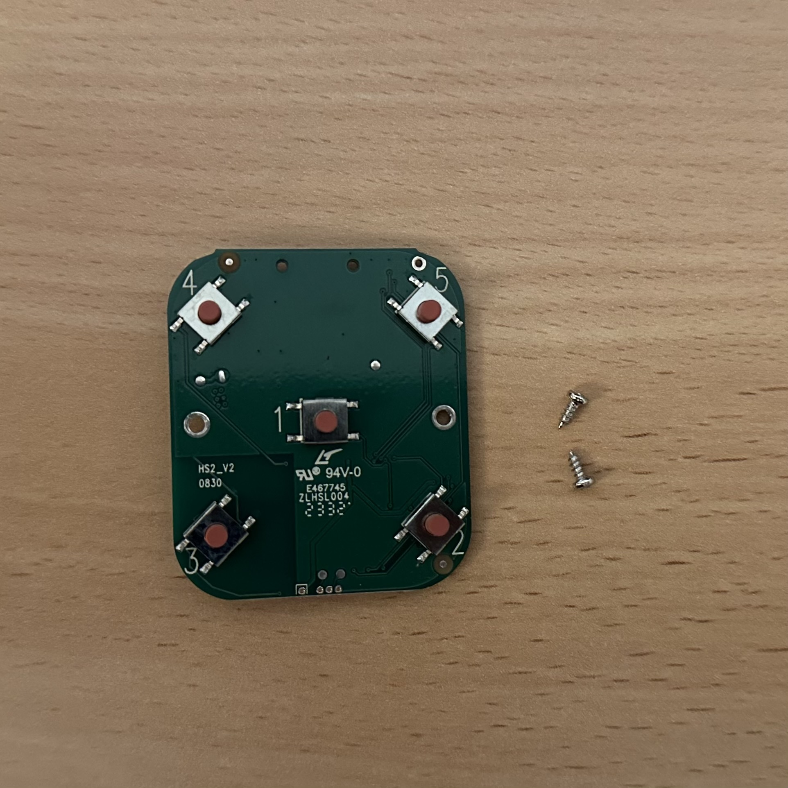
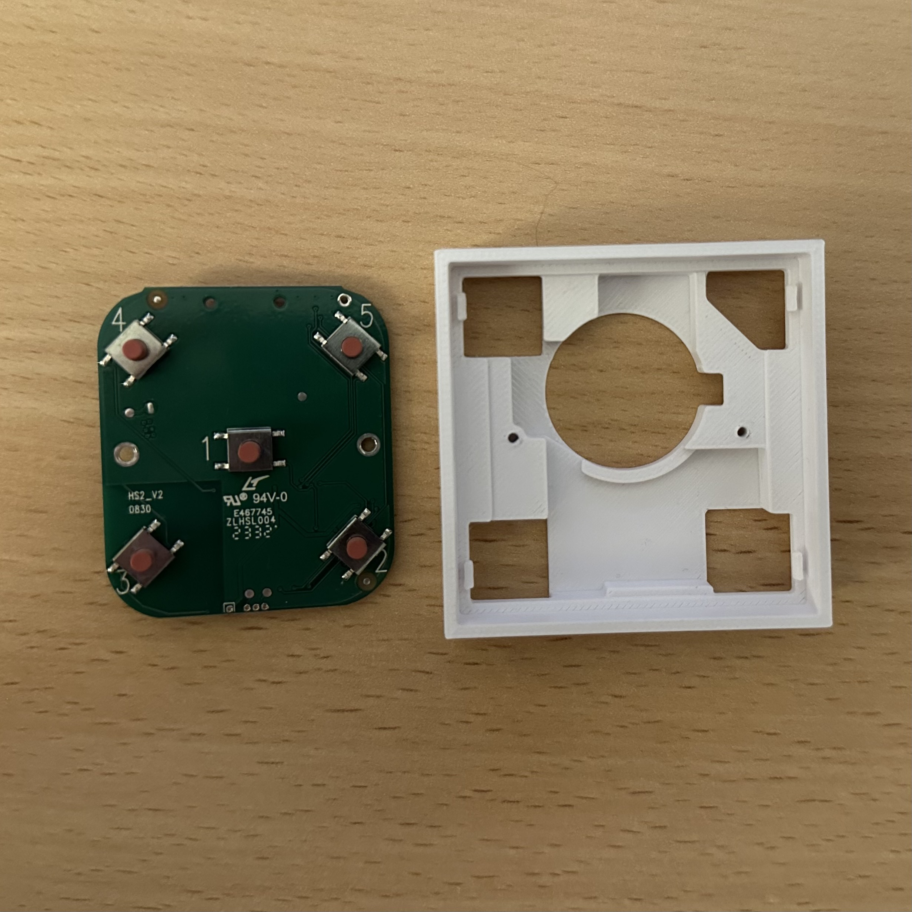
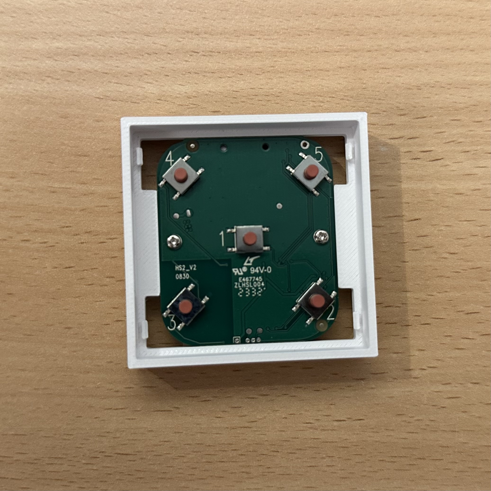
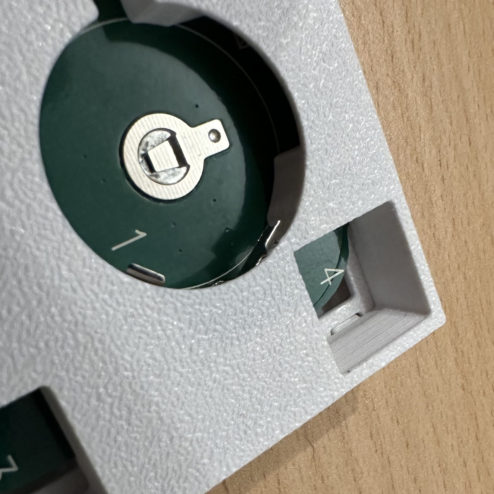
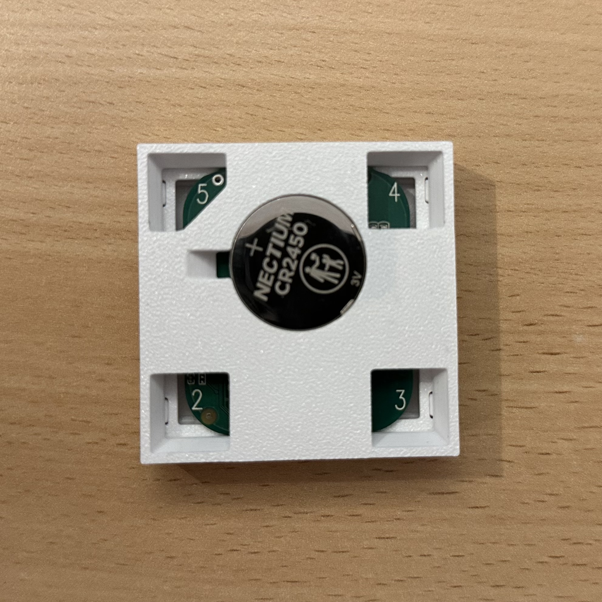
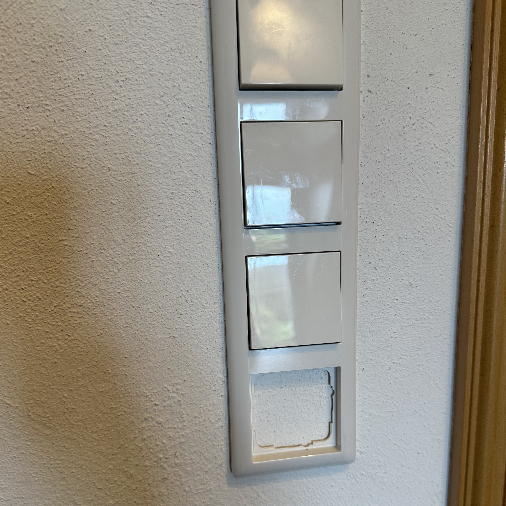
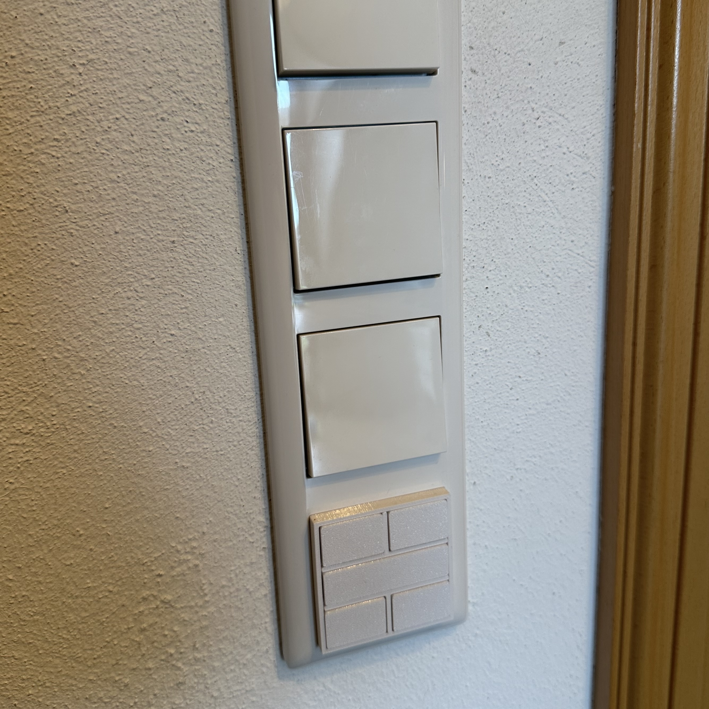

<h3>This mod makes your Onvis Switch HS2 compatible with a Gira System 55 frame.</h3>

This allows for an existing row of switches to be easily expanded without construction work. 
For this, simply buy a larger frame and insert the modified Onvis switch from the front.

<i>Attention. Modifying the device is your responsibility. I am not responsible for possible defects. Opening the device affects the manufacturer's warranty.</i>

<h3>Notes</h3>

  I printed all the parts with the Bambu Lab X1. I cannot guarantee that the parts will also be compatible with other 3D printers. 
  All parts were printed with PETG, 0.4 mm nozzle and 0,2mm layer height. 
  So far, I have only installed switches in the Gira Standard 55 frame and cannot guarantee that the switch is compatible with other design lines. 
  

<h3>Instructions</h3>

Print out the following components in the specified quantity

  1 x base_part.stl 
  1 x top_part.stl 
  1 x large_button.stl 
  4 x small_button 

  

Assemble the switch according to the following steps

<table border="0"> 
  <tr> 
    <td></td> 
    <td>Open the housing by levering the cover off the lower part</td> 
  </tr>
  <tr> 
    <td></td>
    <td>Remove the two marked screws and remove the circuit board</td> 
  </tr>
  <tr> 
    <td></td>
    <td>Keep the circuit board and both screws</td> 
  </tr>
  <tr> 
    <td></td>
    <td>Place the circuit board in this position in the lower part and  
      press the circuit board firmly into place. Make sure that the  
      battery holder on the back is in the correct position. </td> 
  </tr>
  <tr> 
    <td></td>
    <td>Secure the circuit board with the two screws</td> 
  </tr>
  <tr> 
    <td></td>
    <td>Slide the 5 buttons into the side of the top part</td> 
  </tr>
  <tr> 
    <td></td>
    <td>The reverse side should look like this.  
        Insert the battery into the battery compartment at a slight angle.</td> 
  </tr>
  <tr> 
    <td></td>
    <td>The positive pole must be visible from the outside</td> 
  </tr>
   <tr> 
    <td></td>
    <td>Replace your switch frame so that you have a free space.</td> 
  </tr>
   <tr> 
    <td></td>
    <td>Insert the switch into the empty space</td> 
  </tr>
</table>

<a property="dct:title" rel="cc:attributionURL" href="https://github.com/FelixStopa/onvis-switch-hs2-sys55-mod">onvis-switch-hs2-sys55-mod</a> by <a rel="cc:attributionURL dct:creator" property="cc:attributionName" href="https://github.com/FelixStopa">Felix Stopa</a> is licensed under <a href="http://creativecommons.org/licenses/by-nc-sa/4.0/?ref=chooser-v1" target="_blank" rel="license noopener noreferrer" style="display:inline-block;">CC BY-NC-SA 4.0 </a>

