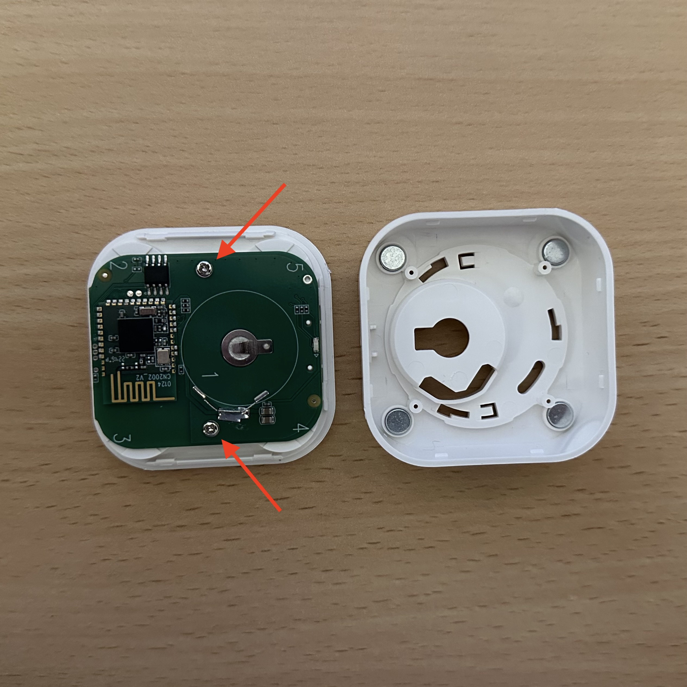
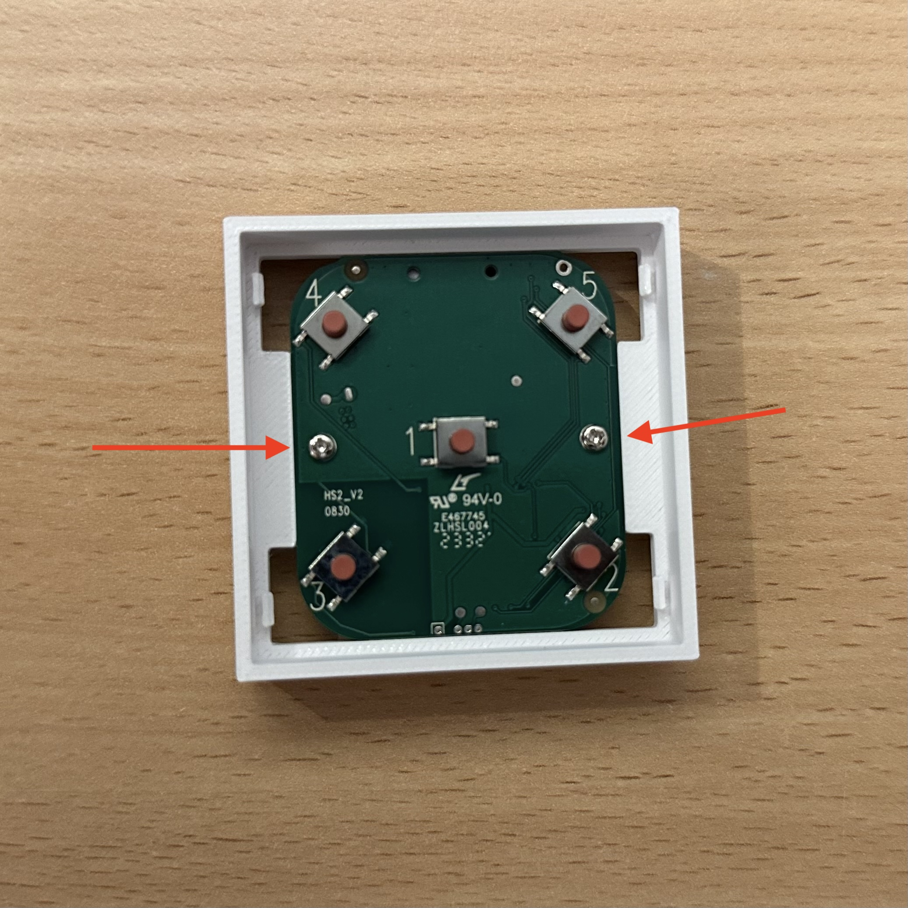
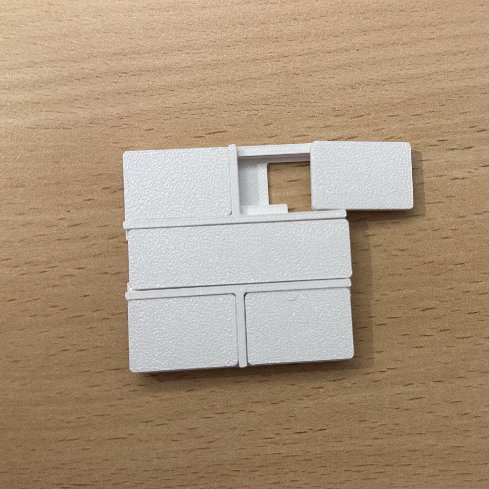

### onvis-switch-hs2-sys55-mod

This mod makes your Onvis Switch HS2 compatible with a Gira System 55 frame.
##### Attention. Modifying the device is your responsibility. I am not responsible for possible defects. Opening the device affects the manufacturer's warranty.

### Instructions

| First Header  | Second Header |
| ------------- | ------------- |
|   | Content Cell  |
|   | Content Cell  |
|   | Content Cell  |
|   | Content Cell  |
|   | Content Cell  |
|   | Content Cell  |
|   | Content Cell  |
|   | Content Cell  |

<a property="dct:title" rel="cc:attributionURL" href="https://github.com/FelixStopa/onvis-switch-hs2-sys55-mod">onvis-switch-hs2-sys55-mod</a> by <a rel="cc:attributionURL dct:creator" property="cc:attributionName" href="https://github.com/FelixStopa">Felix Stopa</a> is licensed under <a href="http://creativecommons.org/licenses/by-nc-sa/4.0/?ref=chooser-v1" target="_blank" rel="license noopener noreferrer" style="display:inline-block;">CC BY-NC-SA 4.0 </a>

